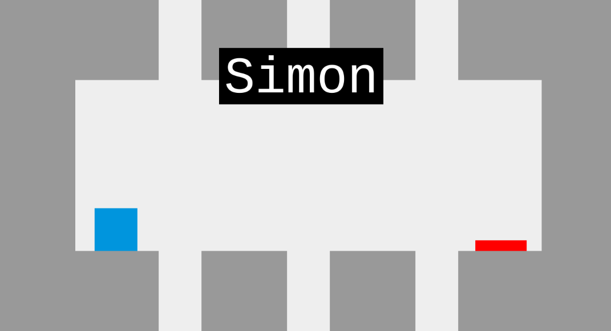

# Milestone 2 - Simon

This is my take on creating a memory game based on Simon, the classic 4 button memory puzzle game. It takes the idea of a memory game and re-imagines it in the style of a platformer. The player takes on the role of Simon, a small blue square, trapped in a mysterious room full of platforms and a big red button. Simon is asked by the narrator if he could push the button as he reassures Simon that he will be there to help guide him. Once the button is pushed the room resets and there is now extra hazards that Simon must avoid. The goal is to get Simon to the button and be sure to follow the narrators instructions.

A link to the live version of the game can be found [here](https://dimensionaldrift.github.io/Milestone_2/index.html).

## UX

The original Simon can be broken into two modes of feedback, the visual and the auditory so it was important that this version incorporated both. From that idea and the basics of game design, some user stories include:
 - As a player I would like an engaging game that is simple to play
 - As a player I would like to be able to play the game on any browser on any device
 - As a player I would like both visual and auditory cues to help remember the sequence
 - As a player I would like visual feedback on my progress
 - As a player I would like some story elements with an air of intrigue

Detail of how I addressed these user stories can be found below in the Features section [below](#features).

## Technologies Used

The challenge for this project was to use little HTML and CSS and focus on using vanilla JavaScript and simple libraries as much as possible for practice. To try and keep the number of libraries used as low as possible it was decided that the CreateJS suite best suited the needs of this project. Some other small libraries were also used as to code their functionality using vanilla JavaScript would have required extensive work, the list of all JavaScript libraries include:

 - CreateJS which includes:
    - EasleJS - Used for canvas manipulation
    - SoundJS - Used to load and play sounds
    - TweenJS - Used to animate objects on the canvas
 - Hammer JS - Used to handle touch input
 - Audiosynth - Used to generate sounds
 - body-scroll-lock - Used to stop iOS overscrolling

All libraries used in this project are pulled directly from a CDN rather than hosted locally in the project. This should help the site load a little faster.

## Features

The game features a simple control scheme, similar to the original Simon game where there are only 4 types of hazards. These hazards are mapped to the 4 directional arrows or on mobile the user can swipe each direction.

The game is fully responsive and scales proportionally depending on the screensize. The size of all objects used in the game are relative, none have hard coded dimensions so that they can be scaled using a multiplicative factor making them look good on any screen size. One limitation imposed is that since the game has a landscape orientation, when the screens dimensions are found to be taller than the are wide (ie portrait) the user is asked to rotate their device. It was important that the user can see the goal of the button at the beginning of the game so I feel that this limitation is justified.

When it came to sound, two initial ideas were considered. The first was that each hazard had it's own physical sounding effect, ie the electricity zaps, the spikes swoosh etc. The other idea was more simple and closer followed the original Simon to use 4 musical notes. Both individually felt lacking and so a combination of the two ideas fit best. The sound effects, found on the free sound library [freesound.org](https://www.freesound.org), have been pitched using Audacity to match the musical note and both play at each hazard.

As players progress through the game unique dialogue is displayed. At first it is there to help guide the player but as the game progresses it becomes clear that there is something more sinister and frantic going on. The game is inspired by other games such as 'Portal' and 'The Stanley Parable' so tries to create an antagonistic atmosphere to help drive the player to continue forward to a conclusion. To help players keep track of their progress each room is numbered at the start so the player can easier see how far they have progressed.

The game uses simple geometric shapes and a simple color scheme inspired by games such as '2048'. This means that it does not need any sprite files and only features a few sound files meaning it should have a small footprint and therefor have short loading times.

## Future Features
Spoiler alert! At them moment the game is endless, there is unique dialogue up until the 15th room but then after that it plays endlessly. In the future I would like to have some conclusion to the game, for example Simon could eventually outsmart the narrator and escape.

At the moment the game always starts with 1 hazard for the first room. Another feature that could be included could be some difficulty settings where, for example, the player starts with more hazards or more are added after each sequence has completed making the memory task harder.

One aspect of Simon that was not included in this version was any sort of timer limiting the time the player has to enter inputs. In the future such a system should be implement as I feel it is missing and maybe could be used as a way to have different difficulty levels. Harder difficulty could mean you have less time to act.

At the moment when played on mobile the address bar is constantly visible while playing the game. It turns out to hide the bar is a very difficult problem to solve cross platform. To hide it on some platforms it's required that the user adds the site to their homescreen as a full-screen web app. In the future this feature could be included to have a better experience on mobile as at the moment the address bar takes up a significant portion of the screen.

## Code Breakdown

The code for the game has been broken up across multiple files grouped by functionality. A simple description of what each file handles can be found below:

#### simon-game.js

 This is the main file for the game which initializes most of the JavaScript libraries and starts listening for keyboard or touch input. When the player enters a move it's passed to gameState object to be computed in simon-logic.js.

#### simon-logic.js

 This is where the logic of the game is computed. The object 'gameState' keeps track of all game moves, player moves and other game arrays. To generate a random move a 'shuffle bag' style generator is used to fill an array with random moves, from which each game move is pulled. Once the array empties it is refilled.

 As the game plays out, each move the player makes is added to an array which is then compared to the array of pre-generated game moves. If the player enters a wrong move the game triggers a game over and resets, otherwise the game continues to play. Once the player completely matches the array, the player array is emptied and a new move is added to the game array making it one hazard longer.

#### simon-graphics.js

 This is where the graphical calculations happen. An event listener measures the size of the screen to set the size of the HTML canvas as it should take up the entire view. It remains listening so that it can also handle when the screen size changes. The size of all objects in the game are relative to the screensize so once it's calculated all object sizes are are calculated and stored in the 'grphState' object.

 Once the game starts, the function 'drawLoop' is repeatedly run every time the game 'ticks' using the CreateJS tick event. It queries the gameState and grphState to then animate whatever state the game is in. For example if a new game move is added then the room is redrawn or if an input is detected from the player the move is animated.

#### simon-draw.js

 This is where all the functions that are used to draw objects for the canvas are kept. All these functions take in (x,y) coordinates and return a shape or object which then must be added to the canvas.

#### simon-audio.js

 This is where the sound libraries are initialized and settings are stored. The paths to the sound files are defined here as well as the sound volume.

## Testing and development

Throughout development all code was written using Sublime and linted on the fly using the Sublimelinter package. Using the plugins, JSHint, CSSlint and HTML Tidy all code was made sure to be valid before committing to git. The Prettier package jsPrettier was also used to keep the code correctly formated.

Using [gtmetrix.com](https://gtmetrix.com) to test the site when hosted on GitHub Pages it receives a page score of 85%, coming in at 675KB and loading in 1.0s.

The game has been tested extensively during development in Chrome Beta on Kubuntu Linux. The game was tested for layout arrangements in different form factors and that it was fully responsive. The game was also tested on Chrome Beta for Android to make sure touch input works correctly. Some limited testing was also done on an iPad in iOS Safari where it was found that when using swipe gestures in WebKit based browsers that the screen would overscroll. The body-scroll-lock library was used to solve that problem. Since I do not have access to any Apple devices for development, Safari based testing has been limited.

A mode has been programed into the game where if cheaterFlag is set to true in the console and the game is started then the game will play itself. When the flag is tripped the user array is set to equal the game array so the game will just animate through all the moves. There is an unusual bug with this feature that Simon will not jump to the final pillar with the button only in the first room. If this mode is set, the player has to 'convince' Simon to jump that last jump by tapping the right arrow key but from then on the game will continue to play. I watched the game play itself a couple of times to test how the randomness felt and to see how far Simon can go. 40 rooms is as far as I have watched it play and it did so without any issues. Keeping an eye on the memory usage, even as it reached high values the memory usage never really increased significantly.

Jasmine has been used to write unit tests for functions where it is possible. The results of those tests can be found [here](https://dimensionaldrift.github.io/Milestone_2/assets/js/jasmine/SpecRunner.html) and the tests themselves [here](https://github.com/DimensionalDrift/Milestone_2/tree/master/assets/js/jasmine/spec). The functions tested using Jasmine have clear inputs or outputs but since the majority of the functions in the game query either gameState or grphState the game would have to start to be able to test those functions properly as they depend on the screensize of the browser.

While the game might appear to players as a platformer the game is really just pattern sequence matching. The game generates a list of moves the player should follow and then waits for the player to enter those moves. The two arrays are compared and if the moves are either correct or incorrect an animation plays. Some feedback I received from playtesters indicated that they felt like they didn't have control and were confused as to why they would lose. I think that is because their intuition was to treat the game as a platformer where you have complete control of the character whereas currently the game is looking for a specific sequence of inputs. This is a limitation of the way the game was designed initially, since the brief was to make a pattern matching game I followed that logical style when building the game then wrapped it in animation that makes it look like a platformer. If I was to redesign the game from the ground up I would treat it more like a platformer where the player can move the character freely.

Early in development, a system to queue moves was implemented. If a user entered a move before an animation has ended then the move was queued to be animated later. During development this seemed like the best approach for user input but in testing with actual players it was found to be more confusing than helpful. It was supposed to allow users to quickly enter the pattern as they remember it but it appears that more often players would accidentally press buttons mid animation and then be confused as to why they would immediately lose once the animation completed. The move queuing system has been switched off for the moment but not completely removed from the game.

## Deployment

During development the liveload node.js module Browsersync was used to host the site locally on the development machine making for super easy testing across devices. This especially made testing on local mobile devices much easier than using an external hosting solution. Once the code was in a feature ready state, git was used to version track commits which were then pushed externally to GitHub. For external testing GitHub Pages has been used to host all versions of the game during development as it was the easiest way for external testers to playtest the game. Since this game runs entirely in JavaScript using only a handful of files that don't need to be altered, GitHub Pages is sufficient for hosting. This was set up by enabling the option in the GitHub repository and ensuring that the repository was structured correctly. The site is hosted from the master branch which has been used as the main development branch throughout development meaning there are no differences between the development version and the hosted version on GitHub Pages.

## Credits

### Media
Links to all sound files used can be found here:
 - https://freesound.org/people/JoelAudio/sounds/136542/
 - https://freesound.org/people/Caitlin_100/sounds/398396/
 - https://freesound.org/people/josepharaoh99/sounds/367125/
 - https://freesound.org/people/junggle/sounds/29301/

### Resources
The bulk of learning and referencing for this project used either Code Institute lessons, the CreateJS documentation or W3schools examples and lessons. Beyond that, any issues that could not be solved using the above resources were mostly found on Stack Overflow. A list of links to any code snippets or significant references that were used in the project can either be found commented throughout the code or found below:

    
Docs

        <ul>
            <li>https://www.createjs.com/docs</li>
            <li>https://github.com/CreateJS/EaselJS/tree/master/examples/Game</li>
            <li>https://hammerjs.github.io/</li>
            <li>https://keithwhor.github.io/audiosynth/</li>
            <li>https://github.com/willmcpo/body-scroll-lock</li>
            <li>https://www.w3schools.com</li>
            <li>https://www.w3schools.com/js/js_best_practices.asp</li>
            <li>https://www.geeksforgeeks.org</li>
        </ul>
 

    
Tutorials

        <ul>
            <li>https://www.createjs.com/tutorials/Animation%20and%20Ticker/</li>
            <li>https://developer.mozilla.org/en-US/docs/Games/Tutorials/2D_Breakout_game_pure_JavaScript</li>
            <li>https://medium.freecodecamp.org/matching-game-with-easel-js-free-time-series-cf803c094a9f</li>
            <li>https://medium.com/@huiwang339/html-canvas-animation-with-javascript-1956426287d3</li>
            <li>https://stackoverflow.com/questions/17242381/html5-canvas-moving-panning-world-with-arrow-keys-in-easeljs/17242545#17242545</li>
            <li>https://gamedevelopment.tutsplus.com/tutorials/how-to-generate-shockingly-good-2d-lightning-effects--gamedev-2681</li>
            <li>https://gamedevelopment.tutsplus.com/tutorials/shuffle-bags-making-random-feel-more-random--gamedev-1249</li>
            <li>https://medium.freecodecamp.org/event-handling-in-javascript-with-examples-f6bc1e2fff57</li>
            <li>http://jtfmumm.com/blog/2013/08/31/nested-higher-order-functions-in-javascript/</li>
            <li>https://medium.com/javascript-scene/javascript-es6-var-let-or-const-ba58b8dcde75</li>
            <li>https://code.tutsplus.com/tutorials/24-javascript-best-practices-for-beginners--net-5399</li>
            <li>https://www.youtube.com/watch?time_continue=1395&v=8aGhZQkoFbQ</li>
            <li>http://latentflip.com/loupe/</li>
            <li>https://chris.beams.io/posts/git-commit/#imperative</li>
            <li>https://preslav.me/2015/02/21/what-s-with-the-50-72-rule/</li>
            <li>https://medium.com/@svinkle/start-a-local-live-reload-web-server-with-one-command-72f99bc6e855</li>
        </ul>

    
Code Snippets

        <ul>
            <li>https://stackoverflow.com/questions/36724818/remove-shapes-with-specific-name-form-stage-in-easeljs/36728703</li>
            <li>https://stackoverflow.com/questions/1230233/how-to-find-the-sum-of-an-array-of-numbers</li>
            <li>https://javascript.info/task/shuffle</li>
            <li>https://www.samanthaming.com/tidbits/35-es6-way-to-clone-an-array</li>
            <li>https://alvarotrigo.com/blog/firing-resize-event-only-once-when-resizing-is-finished/</li>
            <li>https://medium.com/jsdownunder/locking-body-scroll-for-all-devices-22def9615177</li>
            <li>http://jsfiddle.net/lannymcnie/qEYD4/1/</li>
            <li>https://codepen.io/jtangelder/pen/pBuIw</li>
        </ul>

    
Other Resources

        <ul>
            <li>https://www.waitingforfriday.com/?p=586</li>
            <li>https://realfavicongenerator.net</li>
        </ul>

### Acknowledgments
I would like to thank my mentor Chris Zielinski for all his help and advice throughout the project. I would also like to thank my friends and family for being playtesters and for their valuable feedback. Finally I would like to thank Simon for following my instructions and for doing what I say.
