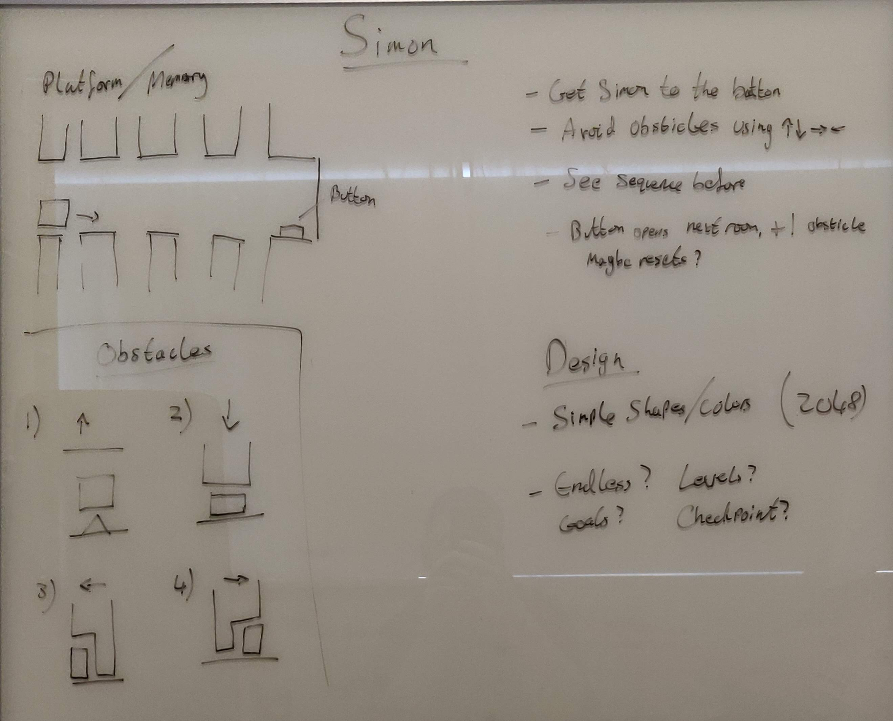
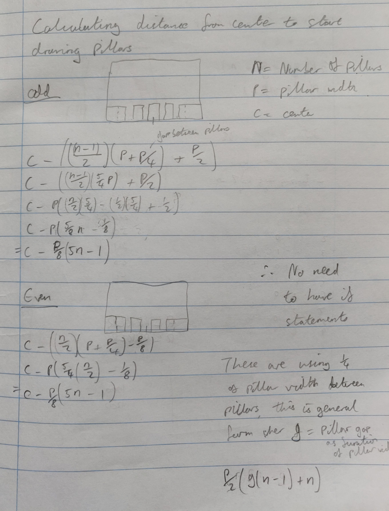

# Development Images

## Mockup

This is the initial design idea for the game. Multiple layouts were not considered as the plan was to scale this design to any screensize. As you can see the ideas for the hazards did change through development. At this stage it was unclear what each of the hazards should be but it was clear that there were only going to be 4.

## Calculations

When building the game, it was clear that if a room was smaller than the screensize it should be centered on the screen. Normally the pillars start at the left edge of the screen but if they are centered then their locations needed to be recalculated based on the center. It was thought at first that two different formulas would be needed for this, one for an even numbers of pillars and one for odd. While trying to simplify the equations it turned out that two formulas reduced to the same form meaning that the two schemes were not needed.

## Favicon
<table>
    <tr>
        <td style="padding:5px">
            
        </td>
        <td style="padding:5px">
            
         </td>
    </tr>
</table>

The two images above were used with the site realfavicongenerator.net to create a packet of icons and images to be used as favicons for testing the site as a full-screen web app for android.